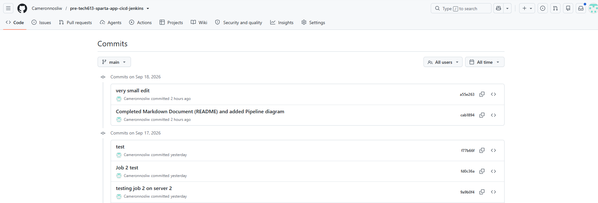

# Sparta App - CI Pipeline Documentation (Cameron Wilson)

- [Sparta App - CI Pipeline Documentation (Cameron Wilson)](#sparta-app---ci-pipeline-documentation-cameron-wilson)
  - [CI Pipeline Diagram](#ci-pipeline-diagram)
  - [Why we set up the CI Pipeline:](#why-we-set-up-the-ci-pipeline)
  - [CI Pipeline benefits:](#ci-pipeline-benefits)
  - [How I set up the jobs:](#how-i-set-up-the-jobs)
  - [Evidence of success:](#evidence-of-success)


This project utilises a two job Jenkins CI pipeline to automate the testing of the dev branch (job 1) and merging of dev to the main branch (job 2). 

## CI Pipeline Diagram
In the diagram below shows the pipeline's stages. The first shows the pipeline process of the initial developer push, the webhook 'listening', where the job is initiated in Jenkins which uses a master node to assign tasks to the agent node. These agent nodes run and if the tests are successful the pipeline automatically proceeds to merge the robust code into the main branch. The blue annotated numbers refer to the process of authentication, triggering and execution.


## Why we set up the CI Pipeline:
By utlising the CI pipeline, we guarantee that every bit of code that is pushed to the dev repo is tested and robust before it reaches the main branch, and it automates this process (in addition to the merge itself).

## CI Pipeline benefits:
* Ensures broken code is not pushed to the main branch.
* Removes the need for developers to manually test, merge and push to main.
* It ensures the process is well-documented.

## How I set up the jobs:
* authentication/security:
  * We utilise an SSH key pair to keep communication between Jenkins and GitHub is secure. We generate the SSH key pair by doing the following commands:
   1. Change directory to where we want to store the SSH key pair: cd ~/.ssh
   2. Created the key pair using the terminal command: ssh-keygen -t ed25519 -a 100 -C "jenkins@spapp-scm-ci"
  * We store the public key on GitHub (within our repo on GitHub, we go to Settings, Deploy Keys, Add Deploy Key and then paste in the public key and allow the option for write access) and the private key within Jenkins (We provide this in the conifguration of job 1 within Source Code management).
* webhook:
  * We provide GitHub with a webhook to 'listen' for a push to the dev branch, which triggers job 1 in Jenkins, when we configure the job to have a GitHub hook trigger.
  * We set up the webhook by visiting our GitHub repo, Settings, Webhooks, click Add Webhook, insert the ip address of the Jenkins server followed by "/github-webhook/" (e.g. http://52.31.15.176:8080/github-webhook/) and then within job 1, we select the build trigger option "GitHub hook trigger for GITScm polling" in order for the job to trigger when a push is made to the dev branch.
* We have the following configuration for job 1:
  
  1. We select a new item, freestyle project and name it appropriately. 
  2. Discard any builds that are more than 5 previous, we provide the GitHub project url (https and without ".git" on the end) to link the job to the repo. 
  3. We next select Git as the option for source code management, where we provide the private SSH key and specify that we are working on the dev branch. As previously mentioned, we select the GitHub hook trigger as the build trigger. 
  4. We select the build environment option "Provide Node & npm bin/ folder to PATH" and specify the Node.js version utilised. 
  5. From here we add a build step, "Execute shell", which runs our terminal commands to run the tests on the newly pushed dev branch (cd app, npm install, npm test). These commands change the directory to the app, as we need to be inside the app directory to perform the tests. We perform npm install to initialise Node.js and then the command npm test performs the tests.
* We have the following configuration for job 2:
  1. We can either create a new freestyle project or copy from job 1 and make changes accordingly. 
  2. These are the same: discard any builds that are more than 5 previous, we provide the GitHub project url (https and without ".git" on the end) to link the job to the repo. 
  3. We next select Git as the option for source code management, where we provide the private SSH key and specify that we are working on the main branch, as we are merging the changes to the main branch. Here we change the build trigger from the webhook to the successful build of job 1 (by selecting the option Build after other projects are built, only if build is stable). 
  4. We select Add SSH agent in build environment to provide the job with permission to push to main. 
  5. From here we add a build step, "Execute shell", which runs our terminal commands to merge the updated dev branch with our main branch (git checkout main, git merge origin/dev, git push origin main). These commands switch to the main branch to allow Jenkins to update it, then merge the code from the dev branch into the main branch, and finally push the updated main branch to GitHub.
  
* expected result:
  * We expect the jobs to run succesfully - meaning tests pass, triggering job 2 where the code that is pushed to the dev branch is successfully merged to the main branch.

## Evidence of success:
* Job 1:
```bash
Started by GitHub push by Cameronnosliw
Running as SYSTEM
Building remotely on EC2 (sparta-aws) - jenkins-node-2204-java17v5 (i-04d1fcddc2f84ae52) in workspace /var/jenkins/workspace/cameron-spapp-job1-ci-test
The recommended git tool is: NONE
using credential cameron-jenkins-2-github-key
 > git rev-parse --resolve-git-dir /var/jenkins/workspace/cameron-spapp-job1-ci-test/.git # timeout=10
Fetching changes from the remote Git repository
 > git config remote.origin.url git@github.com:Cameronnosliw/pre-tech613-sparta-app-cicd-jenkins.git # timeout=10
Fetching upstream changes from git@github.com:Cameronnosliw/pre-tech613-sparta-app-cicd-jenkins.git
 > git --version # timeout=10
 > git --version # 'git version 2.34.1'
using GIT_SSH to set credentials cameron-jenkins-2-github-key
 > git fetch --tags --force --progress -- git@github.com:Cameronnosliw/pre-tech613-sparta-app-cicd-jenkins.git +refs/heads/*:refs/remotes/origin/* # timeout=10
 > git rev-parse refs/remotes/origin/dev^{commit} # timeout=10
Checking out Revision f77b66f93d3cd50992ef9bd26c9360cfd8b9bb40 (refs/remotes/origin/dev)
 > git config core.sparsecheckout # timeout=10
 > git checkout -f f77b66f93d3cd50992ef9bd26c9360cfd8b9bb40 # timeout=10
Commit message: "test"
First time build. Skipping changelog.
[cameron-spapp-job1-ci-test] $ /bin/sh -xe /tmp/jenkins14278221976756115772.sh
+ cd app
+ npm install

> sparta-test-app@1.0.1 postinstall
> node seeds/seed.js

Database connection closed

up to date, audited 372 packages in 2s

59 packages are looking for funding
  run `npm fund` for details

6 vulnerabilities (5 moderate, 1 high)

To address all issues (including breaking changes), run:
  npm audit fix --force

Run `npm audit` for details.
+ npm test

> sparta-test-app@1.0.1 test
> npx mocha --exit

Your app is ready and listening on port 3000


  Homepage
    ✔ should display the homepage at / GET
    ✔ should contain the word Sparta at / GET

  Fibonacci
    ✔ should display the correct fibonacci value at /fibonacci/10 GET


  3 passing (39ms)

Triggering a new build of cameron-spapp-job2-ci-merge
Finished: SUCCESS
```
* Job 2:
```bash
Started by upstream project "cameron-spapp-job1-ci-test" build number 5
originally caused by:
 Started by GitHub push by Cameronnosliw
Running as SYSTEM
Building remotely on EC2 (sparta-aws) - jenkins-node-2204-java17v5 (i-04d1fcddc2f84ae52) in workspace /var/jenkins/workspace/cameron-spapp-job2-ci-merge
[ssh-agent] Looking for ssh-agent implementation...
[ssh-agent]   Exec ssh-agent (binary ssh-agent on a remote machine)
$ ssh-agent
SSH_AUTH_SOCK=/tmp/ssh-XXXXXXlFqbsm/agent.3391
SSH_AGENT_PID=3393
[ssh-agent] Started.
Running ssh-add (command line suppressed)
Identity added: /var/jenkins/workspace/cameron-spapp-job2-ci-merge@tmp/private_key_13232423724677627021.key (jenkins@spapp-scm-ci)
[ssh-agent] Using credentials jenkins (cameron-jenkins-2-github-key)
The recommended git tool is: NONE
using credential cameron-jenkins-2-github-key
 > git rev-parse --resolve-git-dir /var/jenkins/workspace/cameron-spapp-job2-ci-merge/.git # timeout=10
Fetching changes from the remote Git repository
 > git config remote.origin.url git@github.com:Cameronnosliw/pre-tech613-sparta-app-cicd-jenkins.git # timeout=10
Fetching upstream changes from git@github.com:Cameronnosliw/pre-tech613-sparta-app-cicd-jenkins.git
 > git --version # timeout=10
 > git --version # 'git version 2.34.1'
using GIT_SSH to set credentials cameron-jenkins-2-github-key
 > git fetch --tags --force --progress -- git@github.com:Cameronnosliw/pre-tech613-sparta-app-cicd-jenkins.git +refs/heads/*:refs/remotes/origin/* # timeout=10
 > git rev-parse refs/remotes/origin/main^{commit} # timeout=10
Checking out Revision 9a9b0f4550ba7309570a3efc31cfa230223c80d4 (refs/remotes/origin/main)
 > git config core.sparsecheckout # timeout=10
 > git checkout -f 9a9b0f4550ba7309570a3efc31cfa230223c80d4 # timeout=10
Commit message: "testing job 2 on server 2"
 > git rev-list --no-walk 9a9b0f4550ba7309570a3efc31cfa230223c80d4 # timeout=10
[cameron-spapp-job2-ci-merge] $ /bin/sh -xe /tmp/jenkins9006432422857661318.sh
+ git checkout main
Switched to branch 'main'
Your branch is up to date with 'origin/main'.
+ git merge origin/dev
Updating 9a9b0f4..f77b66f
Fast-forward
 app/views/index.ejs | 2 +-
 1 file changed, 1 insertion(+), 1 deletion(-)
+ git push origin main
To github.com:Cameronnosliw/pre-tech613-sparta-app-cicd-jenkins.git
   9a9b0f4..f77b66f  main -> main
$ ssh-agent -k
unset SSH_AUTH_SOCK;
unset SSH_AGENT_PID;
echo Agent pid 3393 killed;
[ssh-agent] Stopped.
Finished: SUCCESS
```
* Screenshot of github to show proof of merge:
  
  
* Further evidence:
  This README is within the same repo, so when this was pushed to dev it initiated the pipeline, and was successful since this can be seen within the main branch of the repo.