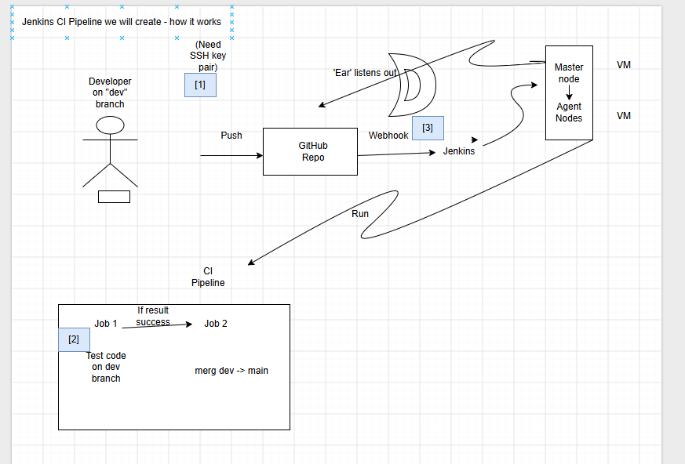

# Sparta App - CI Pipeline Documentation (Cameron Wilson)

This project utilises a two job Jenkins CI pipeline to automate the testing of the dev branch (job 1) and merging of dev to the main branch (job 2). 

## CI Pipeline Diagram
In the diagram below shows the pipeline's stages. The first shows the pipeline process of the initial developer push, the webhook 'listening', where the job is initiated in Jenkins which uses a master node to assign tasks to the agent node. These agent nodes run and if the tests are successful the pipeline automatically proceeds to merge the robust code into the main branch. The blue annotated numbers refer to the process of authentication, triggering and execution.




## Why we set up the CI Pipeline:
By utlising the CI pipeline, we guarantee that every bit of code that is pushed to the dev repo is tested and robust before it reaches the main branch, and it automates this process (in addition to the merge itself).

## CI Pipeline benefits:
* Ensures broken code is not pushed to the main branch.
* Removes the need for developers to manually test, merge and push to main.
* It ensures the process is well-documented.

## How I set up the jobs:
* authentication/security:
  * We utilise an SSH key pair to keep communication between Jenkins and GitHub is secure. We store the public key on GitHub and the private key within Jenkins, providing access to read/ write. This allows Jenkins to perform job 1 and 2.
* webhook:
  * We provide GitHub with a webhook to 'listen' for a push to the dev branch, which triggers job 1 in Jenkins, when we configure the job to have a GitHub hook trigger.
* pipeline triggers:
  * We have the GitHub trigger for job 1 and job 2 has been configured such that job 2 is initiated after a successful build of job 1.
* expected result:
  * We expect the jobs to run succesfully - meaning tests pass, triggering job 2 where the code that is pushed to the dev branch is successfully merged to the main branch.

## Evidence of success:
* Job 1:
```bash
Started by GitHub push by Cameronnosliw
Running as SYSTEM
Building remotely on EC2 (sparta-aws) - jenkins-node-2204-java17v5 (i-04d1fcddc2f84ae52) in workspace /var/jenkins/workspace/cameron-spapp-job1-ci-test
The recommended git tool is: NONE
using credential cameron-jenkins-2-github-key
 > git rev-parse --resolve-git-dir /var/jenkins/workspace/cameron-spapp-job1-ci-test/.git # timeout=10
Fetching changes from the remote Git repository
 > git config remote.origin.url git@github.com:Cameronnosliw/pre-tech613-sparta-app-cicd-jenkins.git # timeout=10
Fetching upstream changes from git@github.com:Cameronnosliw/pre-tech613-sparta-app-cicd-jenkins.git
 > git --version # timeout=10
 > git --version # 'git version 2.34.1'
using GIT_SSH to set credentials cameron-jenkins-2-github-key
 > git fetch --tags --force --progress -- git@github.com:Cameronnosliw/pre-tech613-sparta-app-cicd-jenkins.git +refs/heads/*:refs/remotes/origin/* # timeout=10
 > git rev-parse refs/remotes/origin/dev^{commit} # timeout=10
Checking out Revision f77b66f93d3cd50992ef9bd26c9360cfd8b9bb40 (refs/remotes/origin/dev)
 > git config core.sparsecheckout # timeout=10
 > git checkout -f f77b66f93d3cd50992ef9bd26c9360cfd8b9bb40 # timeout=10
Commit message: "test"
First time build. Skipping changelog.
[cameron-spapp-job1-ci-test] $ /bin/sh -xe /tmp/jenkins14278221976756115772.sh
+ cd app
+ npm install

> sparta-test-app@1.0.1 postinstall
> node seeds/seed.js

Database connection closed

up to date, audited 372 packages in 2s

59 packages are looking for funding
  run `npm fund` for details

6 vulnerabilities (5 moderate, 1 high)

To address all issues (including breaking changes), run:
  npm audit fix --force

Run `npm audit` for details.
+ npm test

> sparta-test-app@1.0.1 test
> npx mocha --exit

Your app is ready and listening on port 3000


  Homepage
    ✔ should display the homepage at / GET
    ✔ should contain the word Sparta at / GET

  Fibonacci
    ✔ should display the correct fibonacci value at /fibonacci/10 GET


  3 passing (39ms)

Triggering a new build of cameron-spapp-job2-ci-merge
Finished: SUCCESS
```
* Job 2:
```bash
Started by upstream project "cameron-spapp-job1-ci-test" build number 5
originally caused by:
 Started by GitHub push by Cameronnosliw
Running as SYSTEM
Building remotely on EC2 (sparta-aws) - jenkins-node-2204-java17v5 (i-04d1fcddc2f84ae52) in workspace /var/jenkins/workspace/cameron-spapp-job2-ci-merge
[ssh-agent] Looking for ssh-agent implementation...
[ssh-agent]   Exec ssh-agent (binary ssh-agent on a remote machine)
$ ssh-agent
SSH_AUTH_SOCK=/tmp/ssh-XXXXXXlFqbsm/agent.3391
SSH_AGENT_PID=3393
[ssh-agent] Started.
Running ssh-add (command line suppressed)
Identity added: /var/jenkins/workspace/cameron-spapp-job2-ci-merge@tmp/private_key_13232423724677627021.key (jenkins@spapp-scm-ci)
[ssh-agent] Using credentials jenkins (cameron-jenkins-2-github-key)
The recommended git tool is: NONE
using credential cameron-jenkins-2-github-key
 > git rev-parse --resolve-git-dir /var/jenkins/workspace/cameron-spapp-job2-ci-merge/.git # timeout=10
Fetching changes from the remote Git repository
 > git config remote.origin.url git@github.com:Cameronnosliw/pre-tech613-sparta-app-cicd-jenkins.git # timeout=10
Fetching upstream changes from git@github.com:Cameronnosliw/pre-tech613-sparta-app-cicd-jenkins.git
 > git --version # timeout=10
 > git --version # 'git version 2.34.1'
using GIT_SSH to set credentials cameron-jenkins-2-github-key
 > git fetch --tags --force --progress -- git@github.com:Cameronnosliw/pre-tech613-sparta-app-cicd-jenkins.git +refs/heads/*:refs/remotes/origin/* # timeout=10
 > git rev-parse refs/remotes/origin/main^{commit} # timeout=10
Checking out Revision 9a9b0f4550ba7309570a3efc31cfa230223c80d4 (refs/remotes/origin/main)
 > git config core.sparsecheckout # timeout=10
 > git checkout -f 9a9b0f4550ba7309570a3efc31cfa230223c80d4 # timeout=10
Commit message: "testing job 2 on server 2"
 > git rev-list --no-walk 9a9b0f4550ba7309570a3efc31cfa230223c80d4 # timeout=10
[cameron-spapp-job2-ci-merge] $ /bin/sh -xe /tmp/jenkins9006432422857661318.sh
+ git checkout main
Switched to branch 'main'
Your branch is up to date with 'origin/main'.
+ git merge origin/dev
Updating 9a9b0f4..f77b66f
Fast-forward
 app/views/index.ejs | 2 +-
 1 file changed, 1 insertion(+), 1 deletion(-)
+ git push origin main
To github.com:Cameronnosliw/pre-tech613-sparta-app-cicd-jenkins.git
   9a9b0f4..f77b66f  main -> main
$ ssh-agent -k
unset SSH_AUTH_SOCK;
unset SSH_AGENT_PID;
echo Agent pid 3393 killed;
[ssh-agent] Stopped.
Finished: SUCCESS
```
* Further evidence:
  This README is within the same repo, so when this was pushed to dev it initiated the pipeline, and was successful since this can be seen within the main branch of the repo.